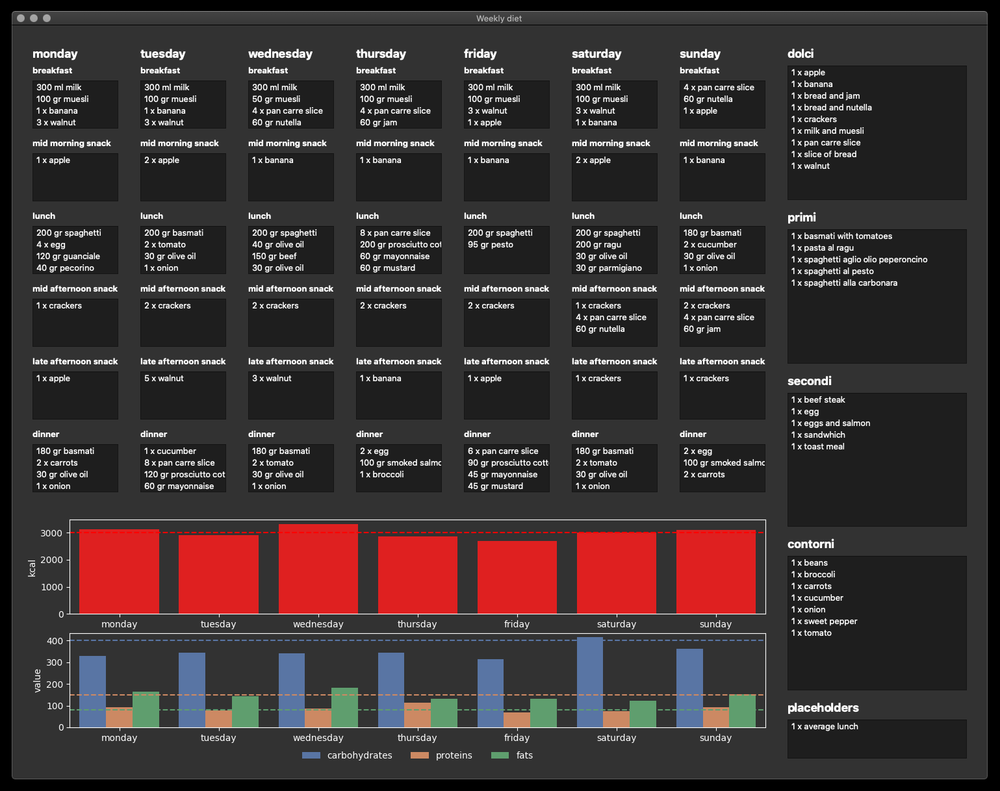

# App to organize my weekly diet

## Disclaimers
* **Since I am busy with many other projects and I didn't want to spend more than one day coding this app (which I wrote because I will use it), I have not curated the quality of the code** and have hardly placed any comment. In particular, the file `gui.py` is a good example of bad code 😛 
* There are tons of apps like this, I could have modified existing code to adapt it to my needs, but it is more fun to write things from scratch 🥳

## The app in brief
The app represents a week made of 6 meals per day. You can drag and drop particular foods, or recipes, into each meal. The total daily calories, carbohydrates, proteins and fats will be shown and you can then generate a shopping list.

### Technologies, data types and usage
* GUI written in `PyQt5`
* Embedded graph plotted with `seaborn`
* Foods stored in `foods.db`, an Sqlite DB. You can create the DB with the helper script `utils/create_table.py`. If you want to add foods you can do it directly in the DB or by editing `utils/foods.csv` and then calling `utils/put_csv_into_db.py` (the csv file is not a mirror of the DB, so for deleting or modifying foods edit he DB)
* Recipes hardcoded as strings in the `initialized_all_derived_foods::recipes` in `foods.py`, when you add a recipe into a meal widget, the recipe will be expanded into the list of its ingredients, so that you can adjust the quantities (e.g. more spaghetti in that meal)
* The diet is stored in `diet.json`, the file is automatically handled by the app. An empty diet is found in `empty_diet.json`
* `primi`, `secondi`, `contorni` and `dolci` are Italian words; their translations could roughly be "main dish rich in carbs", "main dish rich in proteins", "side dish (usually veggies)" and "sweets"
* everything saves automatically, except one case covered in the bugs paragraphs below in which you need to press
* from `report.py` you can set your target calories, carbohydrates, proteins and generate the shopping list

## Limitations and bugs
* Behavior with multiple items. Suppose that you want to eat two apples for breakfast on Monday. You can drag twice `1 x apple` (these two items will not be merged, it's a limitation I know), or you can drag it once and then edit it as `2 x apple`. Mind the singular! Also, keep the spaces as shown, do not write `2x apple`.
* After you finish editing a food, unfortunately the graph is not automatically updated and the diet is not saved; this is an annoying bug that I have not been able to fix; you need to press `CTRL+R` (or `CMD+R` on macOS), or drag foods around, to update the graph. More details on this bug [here](https://github.com/LucaMarconato/weekly_diet/issues/1).
* Tested only on macOS with Dark Mode enabled, probably by disabling it the graphic will not be sleek anymore 😬

## Todo
* Add a method to check that the nutritional information for each food makes sense, this can be automatically looked up online or one can start by checking if the calories are roughly the one expected from the food compositions (carbs, proteins and fats)

## Gallery

